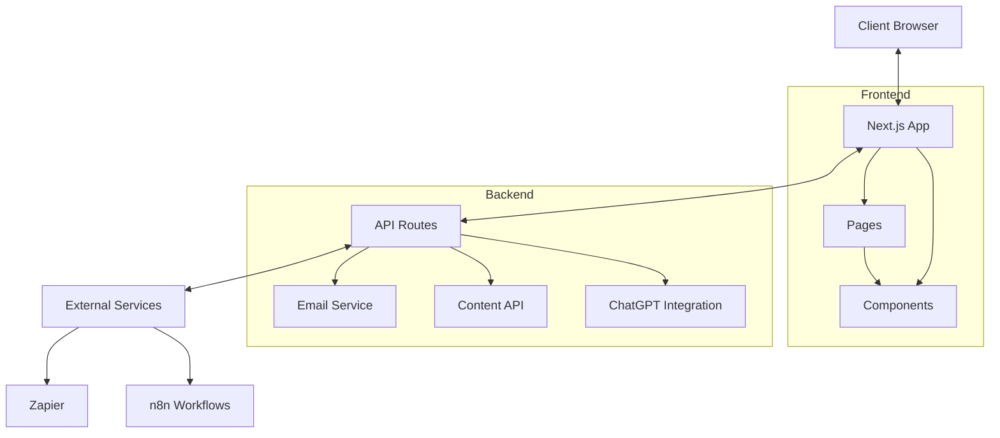
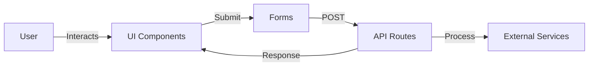

# System Patterns: Loyal Leads Website

## Architecture Overview
The Loyal Leads website is built using a modern web architecture with Next.js as the core framework, following React patterns and conventions.

## Component Structure
The application follows a component-based architecture with reusable UI elements:

- **Layout Components**: Container, RootLayout, Footer
- **UI Components**: Button, GridPattern, CircleBackground
- **Feature Components**: ContactForm, QuotationForm, Chatbot
- **Display Components**: AppDemo, Carousel, BentoGrids

Components are organized by functionality rather than by page, promoting reusability across the application.

## Routing Pattern
Next.js App Router is used for routing with the following structure:
- `/app/page.jsx` - Homepage
- `/app/[section]/page.jsx` - Section pages (about, contact, etc.)
- `/app/blog/[slug]/page.mdx` - Blog post pages
- `/app/api/[endpoint]/route.js` - API endpoints

## State Management
- Local component state using React hooks
- No global state management library identified
- API routes for server-side operations

## Data Flow

## API Integration
- Internal API routes for handling form submissions
- Integration with external services (email, ChatGPT)
- Content API for dynamic content management
- Revalidation endpoints for content updates

## Rendering Strategy
- Static generation for most pages
- Server-side rendering for dynamic content
- Client-side interactivity for forms and chat

This document outlines the key architectural patterns and technical decisions that shape the Loyal Leads website.
