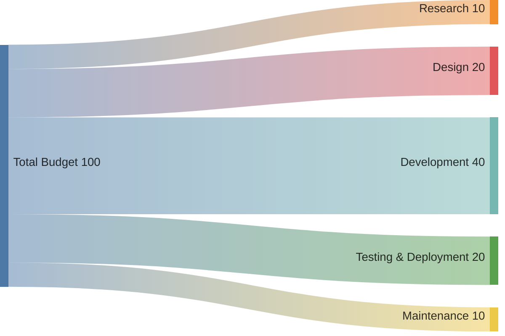
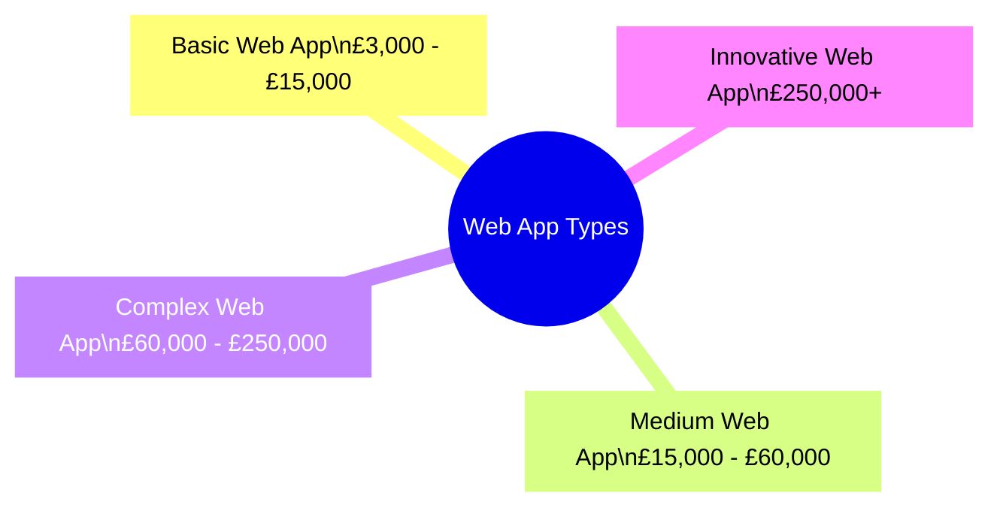
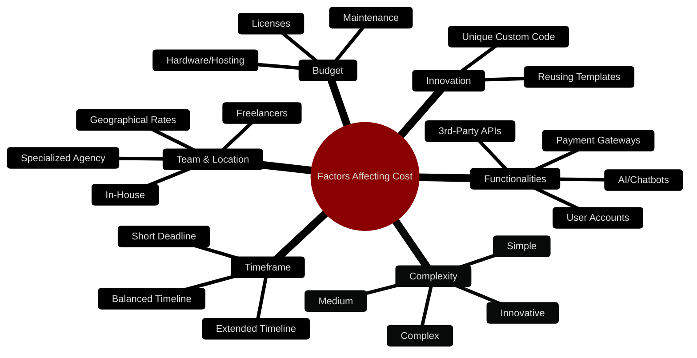

import imageSherifButt from '@/images/team/sherif-butt.jpg'

export const article = {
  date: '2024-12-30',
  title: 'Web App Development Cost Breakdown: Your Ultimate Guide',
  description:
    'Have an exciting web app concept in mind, but worried about the costs involved? Our comprehensive guide outlines everything you need to know.',
  author: {
    name: 'Sherif Butt',
    role: 'Head of Software Development',
    image: { src: imageSherifButt },
  },
}

export const metadata = {
  title: article.title,
  description: article.description,
}

## Web App Development Cost Breakdown: Your Ultimate Guide
*(Proudly based in Cardiff, UK)*

Have an exciting web app concept in mind, but worried about the costs involved? Want a clear, step-by-step breakdown of how much it’ll cost to build a web application?

You’ve come to the right place! In this comprehensive guide, we’ll walk you through every aspect of web app development costs—from the types of web applications and average price ranges to the key factors that drive up (or reduce) expenses. By the end, you’ll know exactly how to estimate your project’s budget and keep it under control.

---

| Complexity Level | Description                                                     | Typical Use Cases                                     |
|------------------|-----------------------------------------------------------------|-------------------------------------------------------|
| **Simple**       | Minimal features, static content                                | Landing pages, portfolios, basic MVPs                |
| **Medium**       | Dynamic content, user logins, 3rd-party integrations           | E-commerce sites, web portals, membership platforms  |
| **Complex**      | Large databases, multiple functionalities, high security        | Enterprise apps, large marketplaces, streaming apps  |
| **Innovative**   | Cutting-edge, custom-coded solutions with unique integrations  | AI-driven platforms, specialized industry products    |

## How Much Does a Web App Cost?

The cost of developing a web application hinges on two main components: **complexity** and **time to build**. In broad terms, web apps can be categorized into four types based on their complexity:

1. **Simple Web Apps** – Basic websites or single-page applications with minimal features.  
2. **Medium (Professional) Web Apps** – Interactive sites with user logins, dynamic content, and some third-party integrations.  
3. **Complex Web Apps** – Large-scale applications with heavy traffic, extensive databases, and multiple functionalities.  
4. **Innovative Web Apps** – Cutting-edge, unique solutions requiring custom-coded features and creative design.

Not sure which category your app idea falls into? We’ll cover how to figure that out in a bit. But first, let’s unpack some of the biggest factors that affect your overall web development costs.

---

## Factors That Affect Web Application Cost

Developing a web application is more than just coding. Several interconnected factors influence your total investment. Here are the top six:

1. **Technical Complexity**  
   - **Simple Apps**: Minimal coding, static info, basic functionality.  
   - **Medium Apps**: Interactive content, user accounts, third-party integrations, robust JavaScript frameworks, etc.  
   - **Complex Apps**: Custom-built, large databases, high security, often enterprise-level or large-scale solutions.

2. **Functionalities Required**  
   - Every new feature (like payment gateways, user accounts, AI chatbots) raises the cost.  
   - The more custom or advanced the feature, the longer it takes to develop.

3. **Innovation vs. Standard**  
   - Using pre-built templates, libraries, and APIs can save time and money.  
   - Building something truly unique from scratch requires more expertise, hence costs more.

4. **Development Team**  
   - You can hire an in-house team, freelancers, or a specialized agency.  
   - Team size and expertise level significantly impact costs.  
   - Common roles include business analysts, front-end and back-end developers, database engineers, UI/UX designers, QA testers, project managers, and content writers.

5. **Location**  
   - Hourly rates vary wildly based on geography. Developers in the US and Canada typically charge more (£65–£200/hr) than those in regions like Eastern Europe or India (£15–£40/hr).

6. **Timeframe**  
   - Projects that need to be built quickly require more resources (more developers, overtime, etc.), raising your costs.  
   - Projects that drag on too long also inflate your budget. A balanced schedule is crucial.

---

## How Much Does Each Phase of Web App Development Cost?

To get an even clearer picture, let’s break it down by the **five main phases** of web development:

| Phase                  | Approx. Cost Range     | Typical Timeframe |
|------------------------|------------------------|-------------------|
| **Research**           | £0–£20,000+           | 1–5 weeks         |
| **Design**             | £40–£40,000+          | 3–6 weeks         |
| **Development**        | £4,000–£40,000+       | Varies            |
| **Testing & Deployment** | £400–£40,000+        | 1–4 weeks         |
| **Maintenance**        | £40–£4,000+ per year  | Ongoing           |

1. **Research (1–5 weeks | ~£0–£20,000+)**  
   - Involves market validation, user research, and competitive analysis.  
   - Can be done in-house or outsourced to specialized research agencies.  
   - Ensures your idea is worth the investment.

2. **Design (3–6 weeks | ~£40–£40,000+)**  
   - Here’s where the wireframes, user flows, and visual prototypes come to life.  
   - A thoughtfully designed UI/UX is critical for user engagement and brand appeal.

3. **Development (Timeline Varies | ~£4,000–£40,000+)**  
   - The coding phase, often the most time-intensive.  
   - Includes front-end (what users see) and back-end (server-side logic, databases) development.  
   - Complex features or integrating multiple technologies increases both time and budget.

4. **Testing and Deployment (1–4 weeks | ~£400–£40,000+)**  
   - Quality Assurance (QA) catches bugs and ensures smooth functionality.  
   - Hosting, domain registration, and additional API fees also factor in here.

5. **Maintenance (Ongoing | ~£40–£4,000+ per year)**  
   - Even after launch, your app will need updates, bug fixes, and possible new features.  
   - Plan for ongoing costs that can be as high as 20% of your total development budget each year.

---

## Estimate Your Web App Cost Yourself

To work out a rough estimate for your custom web app, follow these steps:

1. **Define Your Project Scope**  
   - How many users will your app support? Is it an internal tool or a global platform?
2. **List Required Features**  
   - What’s essential vs. “nice to have”?  
   - Decide if you want advanced features like AI, chatbots, or complex integrations.
3. **Plan Your Development Team**  
   - Do you need just one or two devs or an entire team including QA, designers, etc.?
4. **Choose a Hiring Model**  
   - In-house, freelance, or agency—each has its pros and cons.
5. **Set a Realistic Timeline**  
   - Too short = expensive rush. Too long = higher overhead.  
   - Aim for a balanced, achievable timeline.
6. **Consider Location**  
   - Developer rates differ from region to region.  
   - Outsourcing might be more affordable but consider communication factors like time zones and language.

Once you have these details, you can start getting quotes or do a back-of-the-envelope calculation using average hourly rates in your region of choice.

---

## How to Reduce App Development Costs

Worried that your project might go over budget? Here are a few strategies:

| **Phase**             | **Estimated Timeframe** | **Typical Cost Range** |
|-----------------------|-------------------------|------------------------|
| Research              | 1–5 weeks              | £0–£20,000+            |
| Design                | 3–6 weeks              | £40–£40,000+           |
| Development           | Varies                 | £4,000–£40,000+        |
| Testing & Deployment  | 1–4 weeks              | £400–£40,000+          |
| Maintenance (Yearly)  | Ongoing                | £40–£4,000+ per year   |

1. **Prioritize Your Must-Have Features**  
   - Define your app’s core functionality early on.  
   - Additional features can always be added later.

2. **Build a Prototype or MVP First**  
   - Test your idea with a smaller, functional product.  
   - This helps you gather feedback and validate your concept without blowing the entire budget.

3. **Leverage Third-Party Integrations**  
   - Where possible, use existing APIs or frameworks (e.g., Google Maps) instead of reinventing the wheel.  
   - This saves time, reduces cost, and ensures reliability.

---

## Frequently Asked Questions

**1. How long does it take to develop a web app?**  
A simple web app might take **3–6 weeks**. Professional web apps with payment portals can take **4–12 weeks**. Complex or enterprise-level apps may require **6+ months** of development.

**2. Can I build a web app for free?**  
Some free website builders let you create basic sites, but you still need to pay for hosting and a domain. For anything beyond very simple functionality, working with professional developers or a reputable agency is recommended.

**3. Can I skip web app testing?**  
Definitely not! Testing ensures your app is bug-free and protects your reputation. Skipping it might save a bit upfront but can cost significantly more to fix issues later.

---

## Conclusion

Web app development costs can vary immensely based on complexity, features, and timelines. But with solid planning and a clear understanding of the factors involved, you can get an accurate estimate before you begin.

If you’re in or around **Cardiff, UK** (or anywhere else in the world!) and need expert help bringing your web app idea to life—without breaking the bank—we’re here to assist. Our experienced team specializes in creating custom, cost-effective solutions that meet your unique needs.

**Ready to Build Your Web App?**  
Contact us today for a **free consultation and a personalized quote**. Let’s transform your brilliant idea into an amazing, budget-friendly web application!
