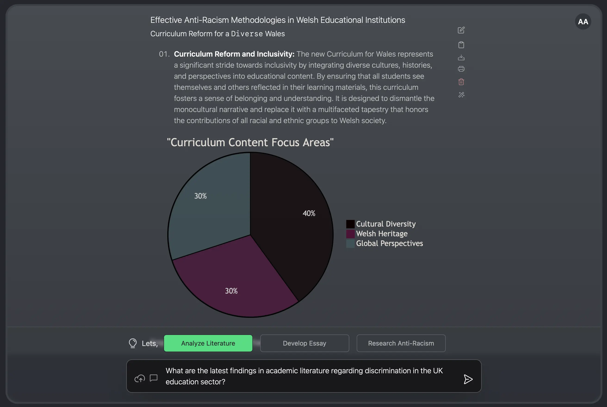
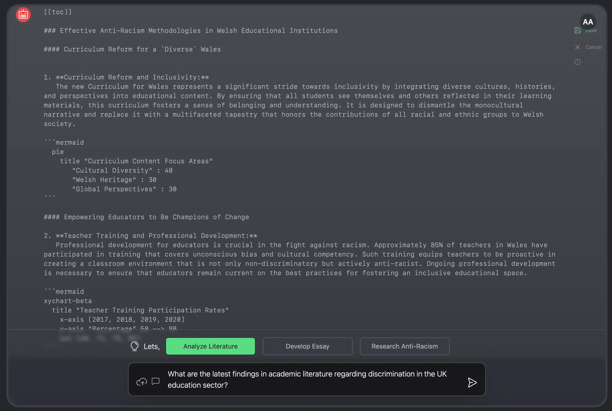

import imageSherifButt from '@/images/team/sherif-butt.jpg'
export const article = {
  date: '2023-11-18',
  title: 'Revolutionizing Education: The Dawn of Teacheraid AI',
  description:
    'Explore how Teacheraid, an innovative AI-driven web app, is poised to transform the educational landscape by automating lesson planning and resource management, custom-tailored for educators.',
    author: {
          name: 'Sherif Butt',
          role: 'Head of Software Development',
          image: { src: imageSherifButt },
        },
 
}

export const metadata = {
  title: article.title,
  description: article.description,
}

Have you ever imagined a world where lesson planning is no longer a tedious task but a seamless, enjoyable experience? **Where hours spent on crafting PowerPoint presentations are reduced to mere minutes?** Welcome to the era of **Teacheraid**, the emerging AI platform designed to revolutionize the educational sector.

### The Genesis of Teacheraid

As the head of software development at Loyalleads.co.uk, I stumbled upon a challenge that seemed all too common among educators: the daunting task of lesson planning and resource management. It was clear that a solution was needed—a solution that could adapt to each teacher's unique instructional style and the intricate policies of their institutions. Enter **Teacheraid**, our ambitious project aimed at automating these tasks with unprecedented accuracy.

### A Tool Not Yet Ready, But Promising

While Teacheraid has shown **flawless performance** in isolated tests, converting lesson plans into polished PowerPoint presentations, it's crucial to acknowledge that it's still in its experimental phase. The journey from a promising prototype to a fully developed product ready for the classroom is filled with obstacles. Yet, the potential to **significantly reduce administrative burdens** and facilitate more impactful teaching experiences is immense.

### Tailored to Teachers' Needs

Our commitment to creating a supportive tool for educators means we prioritize their input above all. By involving teachers early in the development process, we ensure Teacheraid evolves into a platform that not only addresses the challenges they face but also celebrates their unique contributions to education.

### Inclusivity and Security at Its Core

Inclusivity is the heart of Teacheraid's design philosophy. We are dedicated to training our AI on **diverse and unbiased datasets** to support fair and balanced educational opportunities for all learners. Moreover, as we edge closer to a fully operational version, implementing **stringent data protection measures** remains a top priority to ensure the security and privacy of educational content and student data.

### The Road Ahead

Teacheraid, in its current form, represents a blueprint for a groundbreaking tool that promises to transform teaching resource management. Our vision is to deliver a **user-friendly, adaptable, and secure AI assistant** that empowers educators and enriches the learning journey for every student.

**In conclusion**, the path to revolutionizing education with Teacheraid is both challenging and exhilarating. We invite you to join us on this journey, to witness the transformation of educational technology firsthand. **What challenges do you face in lesson planning and resource management?** Share your thoughts, and let's explore how Teacheraid can address them together.

*Share this article on social media, subscribe to our newsletter for updates, and stay tuned for more insights into the future of education technology.*
