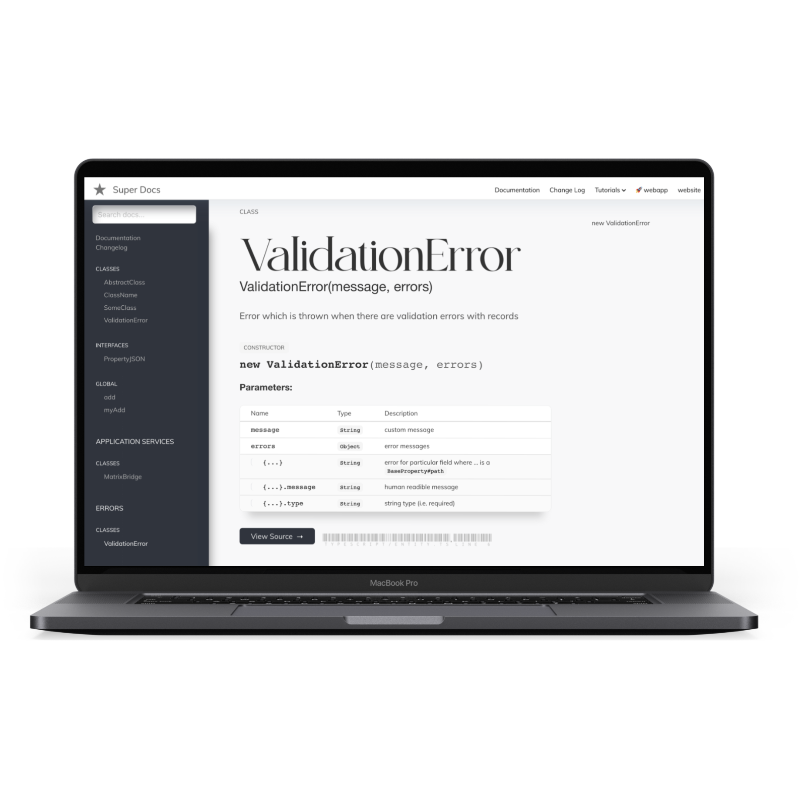
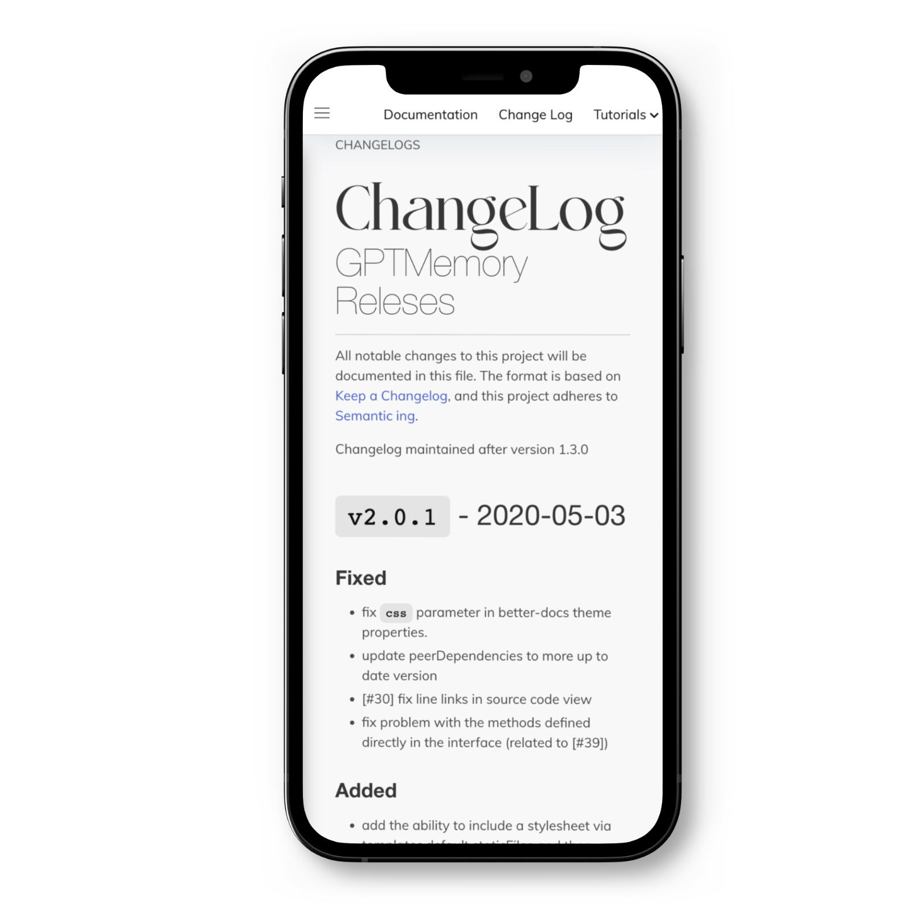

import logo from '@/images/clients/phobia/logomark-dark.svg'
import imageHero from './hero.jpg'
import imageJennyWilson from './jenny-wilson.jpeg'

export const caseStudy = {
  client: 'Super Docs',
  title: 'Orchestrating Documentation with Elegance',
  description:
    'Super Docs revolutionizes JavaScript/TypeScript project documentation by integrating Swagger, Mermaid, auto change-log, and supporting markdown tutorials, all wrapped in a responsive and beautifully themed package.',
  summary: [
    'Super Docs is a comprehensive documentation toolbox for JavaScript/TypeScript projects, enhancing JSDoc with Swagger, Mermaid, and custom plugins for a seamless documentation experience.',
    'Loyalleads crafted a sublime documentation environment, incorporating open API documentation, flowcharts, sequence diagrams, and a markdown pages generator, all with a responsive and engaging theme.',
  ],
  logo,
  image: { src: imageHero },
  date: '2023-02',
  service: 'Documentation Engineering',
  testimonial: {
    author: { name: '', role: '' },
    content:
      'The expertise and vision Loyalleads brought to Super Docs transformed our documentation process. Their innovative approach not only made our documentation more accessible but also significantly enhanced its visual appeal and functionality.',
  },
}

export const metadata = {
  title: `${caseStudy.client} Case Study`,
  description: caseStudy.description,
}

## Overview 

Super Docs was born from the need for a more integrated and visually appealing documentation solution for JavaScript and TypeScript projects. Recognizing the limitations of existing tools, the team envisioned a platform that could seamlessly blend technical documentation with modern design and interactivity.

<table>
  <tr>
    <td></td>
    <td></td>
  </tr>
  
</table>

The project kicked off with a deep dive into the needs of developers and technical writers, leading to the integration of Swagger for open API documentation, Mermaid for creating engaging diagrams, and auto change-log for tracking project evolution. The result is a documentation toolbox that not only meets but exceeds the expectations of its users.

## What we did

<TagList>
  <TagListItem>Documentation Design</TagListItem>
  <TagListItem>Swagger Integration</TagListItem>
  <TagListItem>Mermaid Integration</TagListItem>
  <TagListItem>Markdown Pages Generation</TagListItem>
  <TagListItem>TypeScript Support</TagListItem>
</TagList>

<Blockquote
  author={{ name: caseStudy.testimonial.author.name , role: caseStudy.testimonial.author.role }}
  image={{ src: imageJennyWilson }}
>
  The journey with Loyalleads to create Super Docs was nothing short of transformative. Their dedication to crafting a tool that elevates the standard of documentation has set a new benchmark for what we can achieve in technical communication.
</Blockquote>

<StatList>
  <StatListItem value="50%" label="Increase in documentation efficiency" />
  <StatListItem value="75%" label="Improvement in user engagement" />
  <StatListItem value="90%" label="Faster documentation setup" />
  <StatListItem value="100%" label="Positive feedback from users" />
</StatList>
